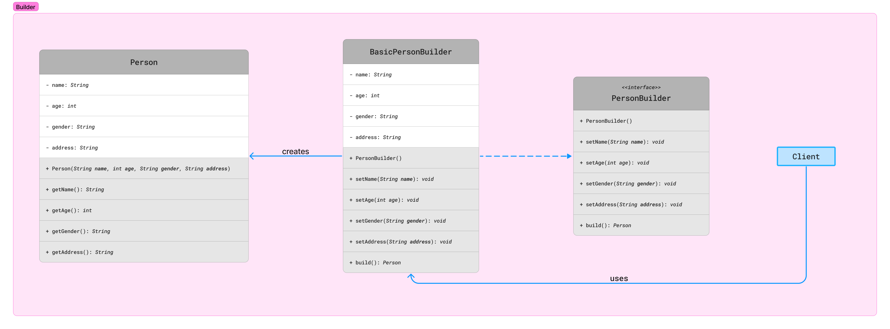

# Builder Design Pattern

## Category

Builder design pattern falls under category of **Creational Design Pattern**.

---

## Problem

It is used to construct complex objects step by step. It aims to separate the construction of a complex object from its representation, allowing the same construction process to create different representations.

In some scenarios, creating complex objects with many configurable options using a single constructor or method can lead to a codebase that is difficult to read, understand, and maintain. Additionally, if the object has many optional parameters, the constructor signature can become unwieldy.

The Builder Design Pattern addresses this problem by encapsulating the construction logic of a complex object into a separate builder class. The builder class provides methods to set individual attributes or configure different parts of the object step by step.

---

## Example

Suppose we need to create a `Person` object with attributes such as name, age, gender, and address. We want a flexible way to construct `Person` objects with different combinations of attributes, including optional ones, while keeping the code clean and maintainable.

While it's possible to use a constructor to create objects and initialize their attributes, but we've to generate constructor for all possible combinations.

When the number of attributes or options increases, modifying constructors by adding more parameters can lead to significant code changes. This will make code unreliable and difficult to manage.

---

## Implementation

1. **Define the `Person` class**: We start by defining the `Person` class with attributes for name, age, gender, and address. We'll also provide a constructor and getter methods for these attributes.

    ```java
    public class Person {
      private String name;
      private int age;
      private String gender;
      private String address;
    
      public Person(String name, int age, String gender, String address) {
        this.name = name;
        this.age = age;
        this.gender = gender;
        this.address = address;
      }
      // Getter methods for name, age, gender, and address
    }
    ```

2. **Define the `PersonBuilder` interface**: Next, we define a `PersonBuilder` interface with methods for setting each attribute of the `Person` object. Each method returns the builder itself to enable method chaining.

    ```java
    public interface PersonBuilder {
      PersonBuilder setName(String name);
      PersonBuilder setAge(int age);
      PersonBuilder setGender(String gender);
      PersonBuilder setAddress(String address);
      Person build();
    }
    ```

3. **Implement the concrete builder**: We create a concrete builder class, `BasicPersonBuilder`, that implements the `PersonBuilder` interface. This class provides methods to set attributes of the `Person` object and constructs the `Person` object when all attributes are set.

    ```java
    public class BasicPersonBuilder implements PersonBuilder {
      private String name;
      private int age;
      private String gender;
      private String address;
    
      @Override
       public PersonBuilder setName(String name) {
        this.name = name;
        return this;
      }
    
      @Override
       public PersonBuilder setAge(int age) {
        this.age = age;
        return this;
      }
    
      @Override
       public PersonBuilder setGender(String gender) {
        this.gender = gender;
        return this;
      }
    
      @Override
       public PersonBuilder setAddress(String address) {
        this.address = address;
        return this;
      }
    
      @Override
       public Person build() {
        return new Person(name, age, gender, address);
      }
    }
    ```

4. **Client code to create `Person` objects**: Finally, we use the builder to create `Person` objects with various attributes. We invoke the builder's methods to set the desired attributes and then call the `build` method to construct the `Person` object.

    ```java
    public class PersonClient {
      public static void main(String[] args) {
        // Create a new instance of the BasicPersonBuilder
        PersonBuilder personBuilder = new BasicPersonBuilder();
        
        // Use the builder to construct a Person object with desired attributes
        Person person = personBuilder
                          .setName("John Doe")
                          .setAge(30)
                          .setGender("Male")
                          .setAddress("123 Main St, City")
                          .build();
        
        // Display the created Person object
        System.out.println("Created Person: " + person);
      }
    }
    ```

> In this example, the Builder Design Pattern enables us to construct `Person` objects with different combinations of attributes in a flexible and maintainable way. We achieve this by separating the construction process from the representation of the `Person` object and providing a fluent interface for setting attributes using the builder. This approach helps us to achieve immutability and improves readability, extensibility, and maintainability of the code.

---

## Class Diagram



---