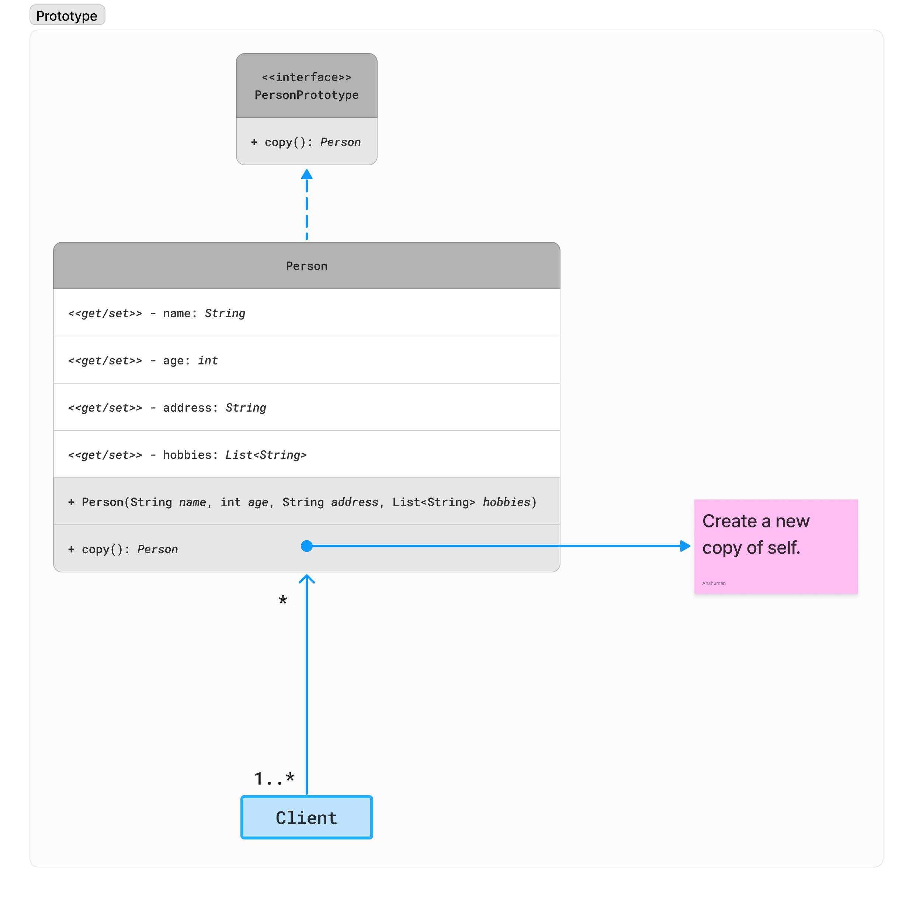

# Prototype Design Pattern

## Category

Prototype design pattern falls under category of **Creational Design Pattern**.

---

## Problem

In some scenarios, creating new objects using a constructor can be inefficient or impractical, especially if the initialization process involves complex logic or resource-intensive operations. Additionally, when multiple instances of similar objects are required, creating each instance from scratch can lead to code duplication and decreased performance.

---

## Example

Suppose, we've a `Person` object that we load from database. Now we need to modify this attributes of this object in our program multiple times, so it’s not a good idea to create that object using `new` keyword and load all the data again from database. The better approach would be to clone the existing object into a new object and then do the data manipulation. Prototype design pattern mandates that the Object which you are copying should provide the copying feature. It should not be done by any other class. However, whether to use shallow or deep copy of the Object properties depends on the requirements, and it's a design decision.

---

## Implementation

### Without `Cloneable`

1. **Define the Prototype Interface**: Create an interface named `PersonPrototype` with methods for displaying, cloning, and modifying person properties such as name, age, and address.
    ```java
    public interface PersonPrototype {
      Person copy();
    }
    ```

2. **Implement Concrete Prototype**: Create a concrete class named `Person` that implements the `PersonPrototype` interface.
    ```java
    public class Person implements PersonPrototype {
      private String name;
      private int age;
      private String address;
      private List<String> hobbies;

      public Person(String name, int age, String address, List<String> hobbies) {
        this.name = name;
        this.age = age;
        this.address = address;
        this.hobbies = hobbies;
      }
      
      public void addHobby(String hobby) {
        this.hobbies.add(hobby);
      }
   
      @Override
      public Person copy() {
        return new Person(this.name, this.age, this.address, new ArrayList<>(hobbies));
      }
      
      // Getters and setters
    }
    ```

3. **Client Code**:
    ```java
    @Test
    void case1() {
      List<String> hobbies = new ArrayList<>();
      hobbies.add("Movies");
      hobbies.add("Photography");
      final Person person = new Person("Anshuman", 26, "Pune", hobbies);
   
      final Person personCopy = person.copy();
      personCopy.setAge(27);
      personCopy.setAddress("Pashan");
      personCopy.addHobby("Music");

      assertEquals(person.getName(), personCopy.getName());
      assertNotEquals(person.getAge(), personCopy.getAge());
      assertNotEquals(person.getAddress(), personCopy.getAddress());
      assertFalse(Arrays.equals(person.getHobbies().toArray(), personCopy.getHobbies().toArray()));
    }
    ```

### With `Cloneable`

We can also implement `Cloneable` interface to create prototype, but this is a non-compliant solution.
All we need to do is implement `Cloneable` interface and override `clone` method. In this case, we're responsible, whether we want deep copy or shallow copy.

```java
public class Person implements Cloneable {
  // Attributes, constructor, getters and setters.
  @Override
  public Person clone() {
     try {
        Person person = (Person) super.clone();
        person.setHobbies(new ArrayList<>(this.hobbies)); // Deep copy the reference type.
        return person;
     } catch (CloneNotSupportedException e) {
        throw new AssertionError();
     }
  }
}
```

> By following these steps, you can implement the Prototype Design Pattern. This pattern allows for the creation and modification of person instances while ensuring that the original prototype remains unchanged. It provides a flexible and efficient way to create new objects with customized properties based on existing prototypes.


---

## Class Diagram




---

## References

In Java, when an object is cloned using the `clone()` method, the object's constructor is not called. Instead, the cloning process creates a new object by copying the state of the existing object, including its fields and their values. This is because object cloning is intended to create a copy of an existing object without invoking its constructor.

The reason for not calling the constructor during cloning is to avoid the potential side effects that may occur if the constructor were to be invoked. Constructors often contain initialization logic, which may allocate resources, establish connections, or perform other operations that are not intended to be executed during cloning.

By not calling the constructor during cloning, Java ensures that the cloned object is a copy of the original object in terms of its state, but it does not execute any additional initialization logic that may be present in the constructor.

It's worth noting that when a class implements the `Cloneable` interface, the `clone()` method creates a shallow copy of the object by default. If a deep copy is required, where all nested objects are also cloned, it's the responsibility of the class to implement custom cloning logic to achieve deep copying.

In summary, Java's `clone()` method creates a copy of an object by copying its state without invoking its constructor to avoid unintended side effects that may arise from constructor execution during cloning.
