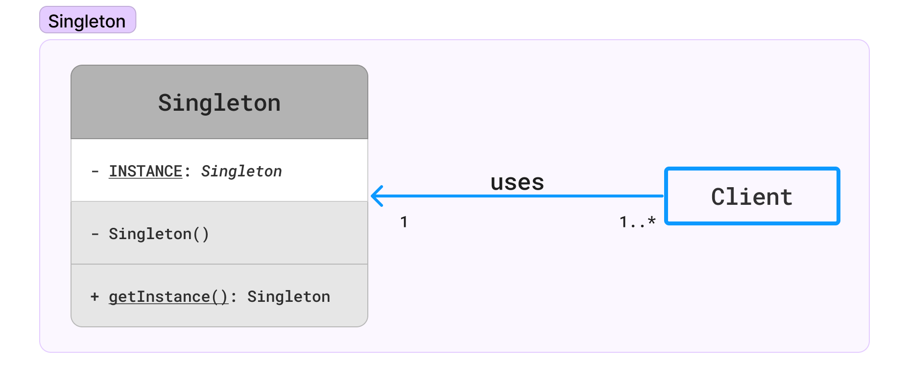

# Singleton Design Pattern

## Category

Singleton design pattern falls under category of **Creational Design Pattern**.  

---

## Problem

You've a class in your software code, and you want to ensure that only a single instance of that class exists throughout the entire execution of the program.

---

## Example

Imagine you've a `Logger` class in your software application that's responsible for logging messages. You want to ensure that there's only one `Logger` instance throughout the entire application to maintain consistent logging.

In this scenario:
- The `Logger` class represents a class in your software code.
- The `Singleton` pattern ensures that only one instance of the `Logger` class exists, ensuring consistent logging across the application.

By using the `Singleton` pattern for the `Logger` class, you guarantee that all parts of the application share and use the same `Logger` instance to log messages, maintaining consistency and avoiding duplication.

---

## Implementation

Here are the steps to implement the Singleton pattern in Java:

1. **Create a `Singleton` class**: Create a class and make its constructor private to prevent instantiation from outside the class.

    ```java
    public class Singleton {
      private Singleton() {} // Private constructor to prevent instantiation
    }
    ```

2. **Declare a static member**: Declare a static member variable of the same class type within the `Singleton` class. This variable will hold the single instance of the class.

    ```java
    public class Singleton {
      private Singleton() {} // Private constructor to prevent instantiation
      private static Singleton instance;
    }
    ```

3. **getInstance method**: Create a static method named `getInstance()` that returns the `Singleton` instance. This method checks if the instance is `null`, and if so, it creates a new instance; otherwise, it returns the existing instance.

    ```java
    public class Singleton {
      private Singleton() {} // Private constructor to prevent instantiation
      private static Singleton instance;
    
      public static Singleton getInstance() {
        if (instance == null) {
          instance = new Singleton();
        }
        return instance;
      }
    }
    ```

4. **Usage**: Access the `Singleton` instance using the `getInstance()` method from any part of your code.

    ```java
    public static void main(String[] args){
      Singleton singletonInstance = Singleton.getInstance();
    }
    ```

With these steps, you've successfully implemented the `Singleton` pattern in Java, ensuring that only one instance of the class exists throughout the application.

---

## Types of implementation

There's two common types of `Singleton` implementation in terms of when the instance of the class is created.

1. **Eager**: In eager initialization, the instance of the `Singleton` class is created at the time of class loading or during the class initialization phase, regardless of whether it is needed or not. This means the instance is created eagerly, hence the name.
   
   ```java
   public class EagerSingleton {
     // Execute at the time of class loading.
     private static final EagerSingleton instance = new EagerSingleton();

     // Private constructor to prevent instantiation from outside
     private EagerSingleton() {}
    
     public static EagerSingleton getInstance() {
       return instance;
     }
   }
   ```
   This approach ensures **thread safety** as the instance is created before any thread can access it, but may consume resources unnecessarily if the instance is not always needed.


2. **Lazy**: In lazy initialization, the instance of the `Singleton` class is created only when it is first requested. This means the instance is created lazily, only when needed.

    ```java
    public class LazySingleton {
      private static LazySingleton instance;
    
      // Private constructor to prevent instantiation from outside
      private LazySingleton() {}
    
      // Instantiate on first request only
      public static LazySingleton getInstance() {
        if (instance == null) {
          instance = new LazySingleton();
        }
        return instance;
      }
    }
    ```
    This approach allows for more efficient resource utilization as the instance is created only if and when it is needed, but requires synchronization if used in a multi-threaded environment to ensure thread safety.

---

## Common pitfalls

Check some common scenarios when `Singleton` pattern can break.

### 1. Thread Safety

Lazy instantiation can introduce thread safety issues in a multi-threaded environment. When multiple threads try to access the `getInstance()` method simultaneously, they may end up creating multiple instances of the class, violating the `Singleton` pattern.

To ensure thread safety in lazy instantiation, we can use `synchronization` mechanisms to make the `getInstance()` method thread-safe. One common solution is to use double-checked locking combined with `volatile` keyword or `synchronized` block.

```java
public class LazySingleton {
    private static volatile LazySingleton instance;

    private LazySingleton() {}

    public static LazySingleton getInstance() {
        if (instance == null) {
            synchronized (LazySingleton.class) {
                if (instance == null) {
                    instance = new LazySingleton();
                }
            }
        }
        return instance;
    }
}
```

In this solution:

- We declare the instance variable as volatile, which ensures that changes made to the variable are immediately visible to other threads.
- We use double-checked locking to ensure that only one instance of the class is created. The first check (`if (instance == null)`) verifies if an instance already exists, and the second check inside the `synchronized` block ensures that only one thread creates the instance (__in case two or more threads reached inside first check__), if it does not exist.

### 2. Serialization 

When a `Singleton` class needs to be serialized (converted into a byte stream for storage or transmission) and then deserialized back into an object, special considerations are needed to maintain the singleton property. By default, serialization and deserialization may violate the Singleton pattern because the standard process creates a new instance of the object.

To address this issue, you can use the `readResolve` method in your Singleton class. This method is called when the object is deserialized, and it allows you to control what instance should be returned.

Here's an example of how you might implement `readResolve` in a Singleton class in Java:

```java
import java.io.Serializable;

public class Singleton implements Serializable {
    private static final long serialVersionUID = 2L;

    private static volatile Singleton instance;

    private Singleton() {}

    public static Singleton getInstance() {
        if (instance == null) {
            synchronized (Singleton.class) {
                if (instance == null) {
                    instance = new Singleton();
                }
            }
        }
        return instance;
    }

    // Implement readResolve to return the existing instance during deserialization
    protected Object readResolve() {
        return getInstance();
    }
}
```

In this example:
- The `readResolve` method is declared to return an `Object`. During deserialization, this method is called, and it allows you to control what object should be returned.
- The `readResolve` method is overridden to return the existing instance of the Singleton using the `getInstance()` method. This ensures that the singleton property is maintained, and the deserialization process doesn't create a new instance.

By including the `readResolve` method, you ensure that the Singleton pattern is not violated during the deserialization process, and only the existing instance of the Singleton is used.

### 3. Cloning

`Cloning` and the `Singleton` pattern have an inherent conflict because the `Singleton` pattern aims to ensure that only one instance of a class exists, while cloning allows the creation of a new object that is a copy of an existing object. Therefore, allowing cloning of a `Singleton` object can potentially break the Singleton pattern by creating multiple instances of the `Singleton` class.

Here's how cloning can affect the Singleton pattern:

1. **Cloning creates a new instance**: When a Singleton object is cloned, the `clone()` method creates a new instance of the class, which violates the Singleton pattern's principle of having only one instance of the class.

2. **Inconsistency in the Singleton instance**: Cloning can lead to inconsistency in the Singleton instance because the cloned object is a separate instance from the original Singleton object. Any changes made to the cloned object will not be reflected in the original Singleton instance, leading to unexpected behavior.

To prevent cloning from breaking the Singleton pattern, you need to implement safeguards in your Singleton class to disallow or control the cloning process. This can be achieved by either:

- Throwing a `CloneNotSupportedException` in the `clone()` method to indicate that cloning is not allowed.
    ```java
    public class Singleton implements Cloneable {
        // Other Singleton code...
    
        @Override
        protected Object clone() throws CloneNotSupportedException {
            throw new CloneNotSupportedException("Cloning of Singleton objects is not allowed.");
        }
    }
    ```
- Providing a custom implementation of the `clone()` method that returns the existing Singleton instance instead of creating a new instance.
    ```java
    public class Singleton implements Cloneable {
        // Other Singleton code...
    
        @Override
        protected Object clone() throws CloneNotSupportedException {
            return INSTANCE; // Return the existing instance
        }
    }
    ```

> Both approaches ensure that cloning of the Singleton object does not result in the creation of multiple instances, thus maintaining the Singleton pattern's integrity. However, it's important to carefully consider the implications and choose the approach that best fits your specific requirements and design considerations.

### 4. Reflection

Reflection in Java allows access to class information, fields, methods, and constructors at runtime, even if they are private. This capability can potentially be used to circumvent the intended behavior of the Singleton pattern and create multiple instances of a Singleton class, thus violating the Singleton pattern's principle of having only one instance.

Here's how reflection can affect the Singleton pattern:

1. **Access to private constructors**: Reflection allows access to private constructors, which are commonly used in Singleton classes to prevent external instantiation. By accessing the private constructor using reflection, a new instance of the Singleton class can be created, bypassing the intended restriction.


2. **Creating multiple instances**: With reflection, it's possible to create multiple instances of a Singleton class by invoking its private constructor. This breaks the Singleton pattern's requirement of having only one instance of the class.


3. **Example**
    ```java
    public static void main(String[] args) {
      // Get the Singleton instance using getInstance() method
      Singleton singleton1 = Singleton.getInstance();
    
      try {
        // Using reflection to access the private constructor
        Constructor<Singleton> constructor = Singleton.class.getDeclaredConstructor();
        constructor.setAccessible(true);
                
        // Creating a new instance using reflection
        Singleton singleton2 = constructor.newInstance();
    
        // Check if both instances are equal
        System.out.println("Are both instances equal? " + (singleton1 == singleton2));
      } catch (Exception e) {
        e.printStackTrace();
      }
    }
    ```

To prevent reflection from breaking the Singleton pattern, you need to implement safeguards in your Singleton class to mitigate the risk of unintended instantiation. Here are some approaches to address this issue:

- **Throwing an exception in the constructor**: You can throw an exception in the Singleton class constructor if an attempt is made to create a new instance using reflection. This prevents external instantiation of the Singleton class.
    ```java
    public class Singleton {
        private static Singleton instance;
    
        // Private constructor to prevent external instantiation
        private Singleton() {
            // Throw an exception if a new instance is created using reflection
            if (instance != null) {
                throw new IllegalStateException("Singleton instance already exists.");
            }
        }
    
        // Other Singleton code...
    }
    ```

- **Using a flag to prevent multiple instantiations**: You can use a flag in the Singleton class to track whether an instance has already been created. If a new instance creation is attempted using reflection, you can check this flag and prevent the creation of additional instances.
    ```java
    public class Singleton {
      private static Singleton instance;
      private static boolean instantiated = false;
    
      // Private constructor to prevent external instantiation
      private Singleton() {
        // Set the flag when the instance is created
        if (!instantiated) {
          instantiated = true;
        } else {
          throw new IllegalStateException("Singleton instance already exists.");
        }
      }
      // Other Singleton code...
    }
    ```
  
- **Using an enum for Singleton implementation**: Enum types in Java are inherently singleton, and they prevent reflection attacks by design. By implementing the Singleton pattern using an enum, you can ensure that only one instance of the Singleton class exists, and it is immune to reflection attacks.
    ```java
    public enum Singleton {
        INSTANCE;
    
        // Add methods and fields as needed
    }
    ```
  Enums in Java are inherently singleton, and they prevent reflection attacks by design. The INSTANCE enum constant represents the single instance of the Singleton class.

> Each of these approaches provides a way to prevent reflection attacks on a Singleton pattern implementation by enforcing the single instance constraint and preventing the creation of additional instances using reflection. Depending on your specific requirements and design considerations, you can choose the approach that best fits your needs.

---

## Class Diagram



---

## References

### 1. `volatile` keyword

In Java, the `volatile` keyword is used to indicate that a variable's value will be modified by multiple threads. It ensures that changes to the variable made by one thread are immediately visible to other threads. Essentially, `volatile` guarantees visibility and ordering of variable updates across threads, but it does not provide atomicity or mutual exclusion like synchronization does.

Here are the key aspects of `volatile`:

- **Visibility**: When a variable is declared as `volatile`, any thread that reads the variable will see the most recent write to that variable by any thread. This means that changes made to a `volatile` variable by one thread are immediately visible to other threads.


- **Ordering**: The `volatile` keyword also ensures that the order of reads and writes to the variable is consistent across threads. This means that if one thread writes to a `volatile` variable and another thread subsequently reads from it, the write operation is guaranteed to happen before the read operation in the overall execution order of the program.

However, it's important to note that `volatile` does not provide atomicity. That is, compound actions involving the `volatile` variable are not guaranteed to be atomic. For example, incrementing a `volatile` variable (`volatileInt++`) is not atomic because it involves multiple read-modify-write operations.

In the context of the previous example of lazy instantiation of a Singleton with double-checked locking, the `volatile` keyword ensures that the changes made to the `instance` variable are immediately visible to other threads, preventing the possibility of returning a reference to an uninitialized or partially constructed Singleton instance. This ensures thread safety and correct behavior in a multi-threaded environment.

> Must check this video about [volatile and atomic (https://youtu.be/WH5UvQJizH0)](https://youtu.be/WH5UvQJizH0?si=_GWOVVeKBWkF3Bje) for better understanding.
